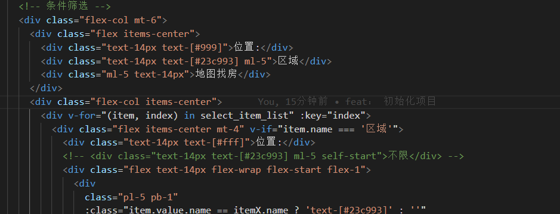

# anjukerentvue

#### 介绍
vue3+ts+ant design vue 框架模仿某居客租房模版，适用于基础的房屋出租，找了很多的源码，索性自己写了一个，简单基础版的，如果页面样式有侵犯版权问题，请及时给予我联系，秉承开源心态，希望多多指教！禁止任何商用行为，相互学习参考！！！切记！！！

#### 软件架构
软件架构说明
1、是一个 ant-design-vue 框架作为主题的UI模版
2、vue3+ ts + vite 架构
3、数据持久化使用  pinia + pinia-plugin-persistedstate
4、样式 使用 windicss 非常强大的 css库，快速的css 布局，抽离业务层 参考地址： [https://windicss.org/](http://)

5、对axios请求框架进行了封装，满足最基础的使用，这样的请求框架参考了 vue-element-plus-admin [输入链接说明](http://element-plus-admin-doc.cn/)，也是站在巨人的肩膀上

#### 安装教程

1.  pnpm install  下载包
2.  pnpm run dev
3.  xxxx

#### 使用说明

1.  xxxx
2.  xxxx
3.  xxxx

#### 参与贡献

1.  Fork 本仓库
2.  新建 Feat_xxx 分支
3.  提交代码
4.  新建 Pull Request

#### 特技

1.  使用 Readme\_XXX.md 来支持不同的语言，例如 Readme\_en.md, Readme\_zh.md
2.  Gitee 官方博客 [blog.gitee.com](https://blog.gitee.com)
3.  你可以 [https://gitee.com/explore](https://gitee.com/explore) 这个地址来了解 Gitee 上的优秀开源项目
4.  [GVP](https://gitee.com/gvp) 全称是 Gitee 最有价值开源项目，是综合评定出的优秀开源项目
5.  Gitee 官方提供的使用手册 [https://gitee.com/help](https://gitee.com/help)
6.  Gitee 封面人物是一档用来展示 Gitee 会员风采的栏目 [https://gitee.com/gitee-stars/](https://gitee.com/gitee-stars/)
